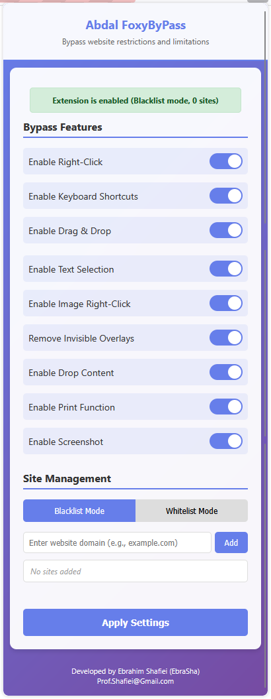

# Abdal FoxyByPass

  

## 📘 Other Languages

- [🇮🇷 Persian - فارسی](README.fa.md)

A powerful Firefox extension designed to bypass website restrictions and limitations, enabling users to regain control over their browsing experience.

## 🌟 Features

### 🔓 Bypass Capabilities

1. **Right-Click Enablement** - Removes restrictions on right-click functionality
2. **Keyboard Shortcuts** - Enables Ctrl+C, Ctrl+U, F12, and other blocked shortcuts
3. **Drag & Drop** - Allows dragging of images and text content
4. **Text Selection** - Enables text selection on protected content
5. **Image Right-Click** - Allows right-clicking on images for save options
6. **Invisible Overlay Removal** - Removes transparent overlays that block interaction
7. **Drop Content** - Enables dropping content onto web pages
8. **Print Function** - Enables Ctrl+P and print functionality
9. **Screenshot Protection** - Removes restrictions on taking screenshots

### ⚙️ Advanced Settings

- **Site Management**: Configure which sites to apply bypass rules to
- **Mode Selection**: Choose between Blacklist (apply to all except listed) or Whitelist (apply only to listed sites)
- **Individual Feature Control**: Enable/disable specific bypass features
- **Instant Application**: All changes apply immediately without page refresh
- **Real-time Feedback**: Visual confirmation when settings are applied

## 🚀 Installation

## 📺 Installation Tutorial

[

### Method 1: Temporary Installation (Development)

1. Open Firefox and navigate to `about:debugging`
2. Click "This Firefox" in the left sidebar
3. Click "Load Temporary Add-on"
4. Select the `manifest.json` file from this extension folder
5. The extension will be installed temporarily (until Firefox is restarted)

### Method 2: Permanent Installation

1. Open Firefox and navigate to `about:addons`
2. Click the gear icon and select "Install Add-on From File"
3. Select the `manifest.json` file from this extension folder
4. Click "Add" to install the extension permanently

## 📖 Usage

    

### Basic Usage

1. Install the extension following the installation instructions above
2. Click the Abdal FoxyByPass icon in your Firefox toolbar
3. All bypass features are enabled by default
4. The extension will automatically apply bypass rules to websites

### Advanced Configuration

1. Click the extension icon to open the settings panel
2. Toggle individual features on/off as needed (changes apply instantly)
3. Configure site management:
   - **Blacklist Mode**: Apply bypass rules to all sites except those in your list
   - **Whitelist Mode**: Apply bypass rules only to sites in your list
4. Add or remove sites from your list (changes apply instantly)
5. All changes are applied immediately without requiring page refresh

### Site Management

- **Adding Sites**: Enter a domain (e.g., `example.com`) and click "Add"
- **Removing Sites**: Click the "Remove" button next to any site in your list
- **Mode Switching**: Toggle between Blacklist and Whitelist modes using the buttons

## 🛠️ Technical Details

### Architecture

- **Background Script**: Manages settings and coordinates between components
- **Content Script**: Injected into web pages to apply bypass rules
- **Popup Interface**: Provides user-friendly settings management
- **Storage**: Uses Firefox's local storage for persistent settings

### Bypass Techniques

The extension uses various techniques to bypass restrictions:

- **Event Listener Override**: Prevents and overrides event handlers that block interactions
- **CSS Override**: Removes CSS properties that prevent text selection and interaction
- **DOM Manipulation**: Removes invisible overlays and blocking elements
- **Keyboard Event Handling**: Intercepts and allows blocked keyboard shortcuts

## 🔒 Security & Privacy

- **No Data Collection**: The extension does not collect or transmit any user data
- **Local Storage Only**: All settings are stored locally in your browser
- **No External Connections**: The extension operates entirely offline
- **Open Source**: Full source code is available for review

## 💻 Compatibility

- **Firefox Version**: 57.0 and later
- **Platforms**: Windows, macOS, Linux
- **Permissions**: Requires access to all websites to function properly

## 🔧 Troubleshooting

### Extension Not Working

1. Ensure the extension is enabled in `about:addons`
2. Check that the site is not in your exclusion list
3. Try refreshing the page after enabling the extension
4. Check the browser console for any error messages

### Settings Not Saving

1. Ensure you click "Apply Settings" after making changes
2. Check that the extension has proper permissions
3. Try disabling and re-enabling the extension

### Performance Issues

1. Disable unnecessary bypass features
2. Reduce the number of sites in your list
3. Restart Firefox if issues persist

## 🏗️ Development

### Building

1. Clone or download the extension files
2. Ensure all files are in the same directory
3. Follow the installation instructions above

 
## 🐛 Reporting Issues

If you encounter any issues or have configuration problems, please reach out via email at Prof.Shafiei@Gmail.com. You can also report issues on GitLab or GitHub.

## ❤️ Donation

If you find this project helpful and would like to support further development, please consider making a donation:
- [Donate Here](https://alphajet.ir/abdal-donation)

## 🤵 Programmer

Handcrafted with Passion by **Ebrahim Shafiei (EbraSha)**
- **E-Mail**: Prof.Shafiei@Gmail.com
- **Telegram**: [@ProfShafiei](https://t.me/ProfShafiei)

## 📜 License

This project is licensed under the GPLv2 or later License. 1.15.0 